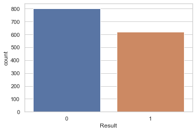

# Anemia Dataset

Anemia dataset[1] contains 1421 datapoints including below 5 features: 
- **Gender:** 0 is Male and 1 is Female
- **Hemoglobin:** Hemoglobin is the protein in your red blood cells that transports oxygen to the tissues of your body.
- **Mean Corpuscular Hemoglobin Concentration (MCHC):** MCHC value found on a complete blood count (CBC) describing the average hemoglobin concentration in a given volume of red blood cells [2].
- **Mean Corpuscular Volume (MCV):** An MCV blood test measures the average size of your red blood cells [3].
- **Mean Corpuscular Hemoglobin (MCH):** MCH value refers to the average quantity of hemoglobin present in a single red blood cell [4].
and 1 label:
- **Results:** 0 is Not Anemic and 1 is Anemic 

As you can see in the below image that the dataset is fairly in balanced state.

---

[1] [Kaggle link](https://www.kaggle.com/datasets/biswaranjanrao/anemia-dataset)

[2] MCHC Blood Test Results: Meaning of Low and High Levels, https://www.verywellhealth.com/mean-cell-hemoglobin-concentration-4584155, access: 13/12/2022

[3] MCV (Mean Corpuscular Volume), https://medlineplus.gov/lab-tests/mcv-mean-corpuscular-volume/, access: 13/12/2002

[4] What Is MCH and What Do High and Low Values Mean?, https://www.healthline.com/health/mch, access: 13/12/2022
